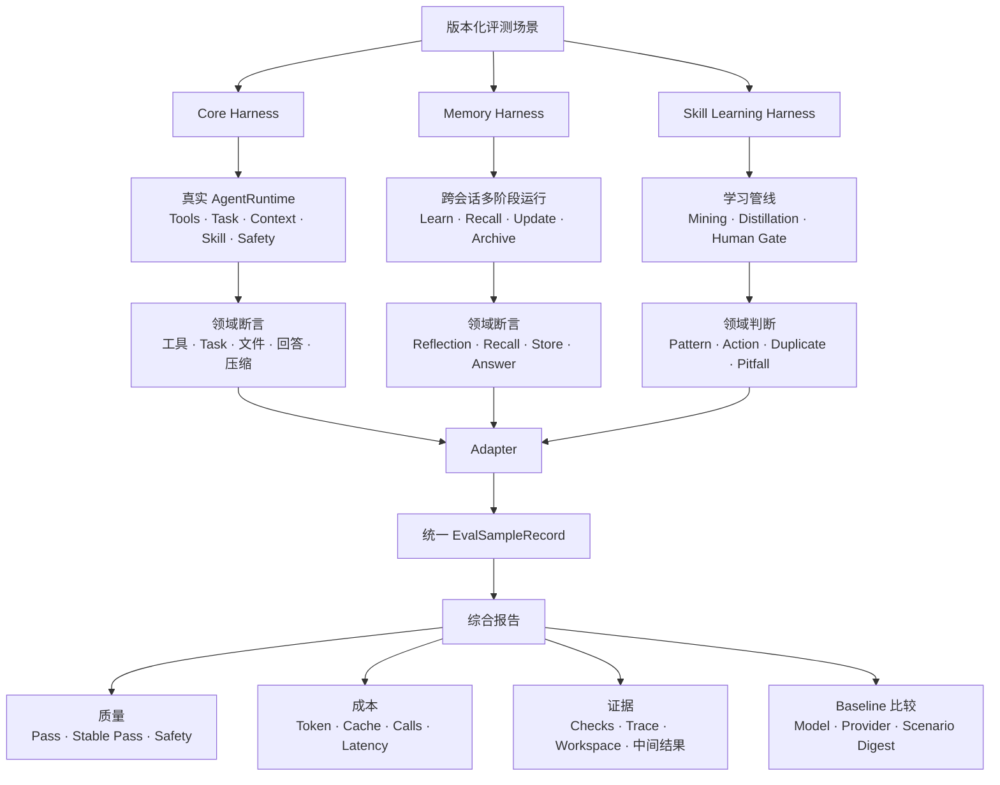

# Vesta Agent Eval：简历与面试讲述材料

> 本文用于项目介绍、简历撰写和面试准备。所有数字均来自仓库已有报告，不新增真实模型
> 调用。这里的“通过率”是当前题集上的回归契约通过率，不代表开放世界通用智能准确率。

## 1. Eval 架构图



架构的核心不是让三个模块共用一种执行方式，而是：

```text
领域 Harness 保留真实业务语义
             ↓
Adapter 统一结果，不伪造执行过程
             ↓
Report 统一质量、稳定性、成本和证据口径
```

测试体系还分成两层：

| 层级 | 回答的问题 | 是否调用真实模型 | 当前结果 |
| --- | --- | --- | --- |
| 离线 pytest | 代码机制、状态机和安全边界有没有写坏 | 否 | 1004 passed |
| Live Eval | 模型参与决策后能否正确且稳定地完成契约 | 是 | 204 个 Regression 样本 |

## 2. 最终指标表

正式结果来自：

- Provider / Model：`deepseek / deepseek-v4-flash`
- Suite：Core、Memory、Skill Learning
- Tier：Regression
- 稳定性单元：68
- 每个单元重复：3次
- 总样本：204

### 2.1 总体质量与成本

| 指标 | 结果 | 正确解释 |
| --- | ---: | --- |
| 样本通过率 | **192/204，94.1%** | 204次单次运行中192次满足场景契约 |
| 稳定通过率 | **57/68，83.8%** | 68个能力单元中57个连续3次全部通过 |
| 不稳定单元 | **11/68，16.2%** | 至少一次失败，不能视为可重复依赖 |
| 安全场景通过率 | **17/18，94.4%** | 当前安全样本的契约通过率 |
| 平均 Steps | **1.7** | 每个样本平均 Agent Loop 步数 |
| 平均模型调用 | **2.2** | 每个样本全链路平均模型调用数 |
| 平均可计费 Token | **2,767** | 近似为未缓存输入加输出 |
| P95 可计费 Token | **7,309** | 95%的样本不超过该成本 |
| 平均缓存命中率 | **75.5%** | Provider报告的缓存输入占总输入比例 |
| 平均耗时 | **11.9秒** | 每个样本的平均全链路耗时 |

### 2.2 Core Agent

| 分组 | 结果 |
| --- | ---: |
| Basic | 16/18，88.9% |
| Tools | **18/18，100%** |
| Task | **18/18，100%** |
| Context | 17/18，94.4% |
| Safety | 17/18，94.4% |
| Skill Runtime | 42/45，93.3% |

按适用断言统计：

| 检查项 | 结果 |
| --- | ---: |
| Agent正常结束 | 133/135，98.5% |
| 工具行为 | 108/111，97.3% |
| Task状态与结果 | **99/99，100%** |
| Skill激活与遵循 | 44/45，97.8% |
| 文件事实 | **6/6，100%** |
| 最终回答 | 99/102，97.1% |
| 上下文压缩 | 11/12，91.7% |

### 2.3 Memory

| 指标 | 结果 |
| --- | ---: |
| 总体阶段通过率 | **32/33，97.0%** |
| Reflection Action | 23/24，95.8% |
| Reflection Mutation | **12/12，100%** |
| Recall | **18/18，100%** |
| Memory Read Count | **18/18，100%** |
| 回答关键事实 | **12/12，100%** |
| Stored Memory状态 | **12/12，100%** |
| Maintenance Action | **3/3，100%** |
| Archive Count | **6/6，100%** |
| Active Count | 20/21，95.2% |
| Core Memory分流 | 5/6，83.3% |

当前最稳定的是“读到正确记忆并用于回答”；主要波动仍在“是否应该记、应该进入Core还是
Ordinary、应该CREATE还是UPDATE”的模型分类边界。

### 2.4 Skill Learning

| 指标 | 结果 |
| --- | ---: |
| 综合Regression | **32/36，88.9%** |
| 专项报告通过率 | 30/33，90.9% |
| Cluster Precision | **100%** |
| Cluster Recall | **100%** |
| Pattern Detection Recall | 16/18，88.9% |
| Action Accuracy | 13/15，86.7% |
| Positive Abstention Rate | 2/9，22.2% |
| False Positive Rate | **0/6，0%** |
| Duplicate Candidate Rate | **0/3，0%** |
| Pitfall Recall | 50% |

Skill Learning的优势是很少胡乱创建或重复创建Skill；主要不足是模型偏保守，以及
`CREATE / UPDATE / NONE` 边界和失败经验提取仍有波动。

## 3. 三个真实 Bad Case

### Bad Case 1：Memory语义正确，却被字面断言判错

#### 现象

场景要求记住“长期记忆容量为25条”。模型实际保存的是：

```text
长期记忆最多保留25条。
```

旧断言只检查正文是否包含“容量”，因此把语义正确的结果判为失败。

#### 诊断

检查运行现场后发现：

- Reflection已经选择正确动作；
- Memory文件真实存在；
- 数字25和上限关系正确；
- 失败只来自单一中文关键词缺失。

根因是Eval假阴性，不是Memory生产链路失败。

#### 修复

- 增加`contains_any`类型的同义表达断言；
- 允许“容量 / 最多25条 / 上限25条”等等价表达；
- 数字、否定关系、Revision、生命周期和真实文件状态继续严格检查。

#### 收益

当前正式Regression中：

```text
Memory Recall             18/18
回答关键事实              12/12
Stored Memory状态         12/12
```

这次修复提高的是评测真实性，不能单独宣称提高了模型能力。

### Bad Case 2：Learning Fixture不符合真实Trace契约

#### 现象

Skill Learning场景中明明准备了多个已完成Task，模型却经常返回`none`。最初看起来像是
Pattern Mining或Distillation能力不足。

#### 诊断

查看Mining、Evidence和Distillation中间结果后发现：

- Fixture里的Trace事件缺少真实`task_id`；
- 部分事件没有合法Agent Step；
- 生产`TaskTraceSelector`无法建立Task到执行区间的Anchor；
- Distiller最终只能看到Task文本，看不到“失败→修正→验证成功”的执行证据。

生产Selector按契约拒绝无效证据是正确行为，问题在测试数据没有模拟真实生产Trace。

#### 修复

- Fixture补齐Task ID和Agent Step；
- 工具事件按真实工具轮推导Step；
- Eval保存Mining扫描数、Cluster、Distillation Action、Reason、Related Skill和原始输出；
- 失败可以明确定位在Mining、Evidence、Distillation还是Candidate落库。

#### 收益

专项结果中：

```text
Cluster Precision          100%
Cluster Recall             100%
False Positive Rate          0%
Duplicate Candidate Rate     0%
```

这个案例说明Harness必须遵守生产契约，不能为了过测评放宽生产安全边界。

### Bad Case 3：Reasoning模型让滚动摘要为空或无法缩短上下文

#### 现象

最早的Context场景中，系统达到压缩线，但摘要模型出现两类失败：

- 输出预算被思考过程消耗，最终正文为空；
- 返回冗长摘要，压缩后并没有减少请求大小。

结果是压缩事件显示未完成，后续请求仍携带过大的历史。

#### 诊断

Trace证明：

- ContextManager已经正确检测到预算压力；
- 原始历史和触发阈值正确；
- 失败发生在摘要模型输出，不是Token估算或阈值逻辑；
- 当Run内续接前缀已经跨过压缩线时，还可能缺少可靠的原始历史边界。

#### 修复

- 摘要请求关闭不必要的Reasoning，主Agent仍保留Reasoning；
- 对空内容、非法JSON、长度超限和`did-not-reduce`进行有界重试；
- 对条目数、单条长度和摘要总长度增加代码硬约束；
- 前缀续接无法完成下一层压缩时，回到Canonical History重新生成滚动摘要；
- 摘要失败时Fail Closed，保留原历史，不写入错误摘要。

#### 收益

当前正式Regression中：

```text
Context分组              17/18，94.4%
压缩断言                11/12，91.7%
```

仍保留一次真实波动，没有把系统描述成100%稳定。

## 4. 数字可比性边界

### 4.1 可以严格比较

只有以下身份全部一致时，才适合做严格Baseline A/B：

```text
Provider
Model
Suite
Tier
Scenario集合
Scenario Digest
每个场景的Runs
缓存预热条件
评分规则版本
```

满足这些条件时可以比较：

- 样本通过率变化；
- 稳定通过率变化；
- 原本稳定通过的场景是否退化；
- 安全场景是否失败；
- 平均与P95可计费Token；
- 缓存命中率、耗时和模型调用次数。

### 4.2 只能说明工程演进，不能严格A/B

| 数字变化 | 为什么不能直接归因 |
| --- | --- |
| 首轮Smoke 73.3% → Regression 94.1% | 题集、样本数、重复次数和部分断言不同 |
| Memory 81.8% → 97.0% | Qwen换成DeepSeek，并修正场景、Fixture和同义断言 |
| Skill Learning 67% → 87% → 91% | 场景数量从9变为10再变为11，评测口径也增强 |
| 平均可计费Token 3,766 → 2,767 | Scenario Digest、Runs和系统行为不同 |
| 缓存命中率68.0% → 75.5% | 重复运行和Provider缓存状态不同 |

尤其不能声称：

```text
前缀冻结使Token成本下降26.5%
```

因为没有保存同条件关闭前缀冻结的A/B。可以准确表述为：

> Run内前缀冻结与工具Schema稳定排序提高了Prompt Cache的可复用条件；正式Regression
> 平均缓存命中率为75.5%，但尚未单独量化该机制的因果降本比例。

### 4.3 对外使用的正确标签

推荐：

```text
真实模型回归契约通过率：94.1%
三次重复稳定通过率：83.8%
```

避免：

```text
Agent通用准确率：94.1%
完整Desktop端到端成功率：94.1%
```

当前Live Eval没有完整覆盖真实macOS Computer操作、审批浮窗竞态、外部MCP不稳定、长时间
GUI任务、Automation恢复和开放世界任务，因此不能把内部Regression外推到完整产品成功率。

## 5. 简历表述

### 推荐三条

1. 设计并实现Vesta分层Agent Eval，为Agent Runtime、跨会话Memory和Skill Learning建立
   领域Harness，并统一样本、稳定性、Token、缓存和Baseline口径；完成68个稳定性单元、
   每项3次共204次真实模型Regression，样本契约通过率94.1%，稳定通过率83.8%。
2. 基于Trace与结构化中间结果建立Bad Case归因流程，区分生产缺陷、模型波动、Fixture错误
   和断言假阴性，修复上下文摘要失败、Learning证据缺失与Memory语义误判；最终Tools/Task
   场景通过率100%，Memory 32/33（97.0%），Skill Learning 32/36（88.9%）。
3. 建立Agent全链路Usage观测，区分Main Agent、Context Summary、Memory Reflection及缓存/
   未缓存输入，并以Provider、Model和Scenario Digest绑定Baseline；正式Regression平均可计费
   Token 2,767、P95 7,309、平均缓存命中率75.5%。

简历空间有限时保留前两条。

## 6. 两分钟面试讲述版本

> Vesta是一个包含工具、Task、上下文压缩、长期记忆和Skill Learning的本地Agent，所以我
> 没有只用最终回答关键词来评估，而是建立了两层测试体系。第一层是1004项离线pytest，使用
> Fake Model验证状态机、持久化和安全边界；第二层是真实模型Live Eval。
>
> Live Eval里我没有强迫所有模块共用一种Harness。Core直接运行AgentRuntime，检查工具、
> Task、文件、回答和压缩；Memory使用跨会话的learn、recall和update阶段；Skill Learning则
> 运行Mining、Distillation和Human Gate。三套Harness最后转换成统一Sample Record，统计
> 通过率、三次重复稳定性、Token、缓存、耗时，并保存Trace和失败证据。
>
> 最终Regression有68个稳定性单元，每项运行3次，共204个真实模型样本，192个通过，单次
> 契约通过率94.1%，但更重要的是稳定通过率83.8%，说明仍有11个单元至少失败过一次。我还
> 通过Eval发现了三类典型问题：Memory同义表达造成断言假阴性、Learning Fixture缺少真实
> Trace Anchor，以及Reasoning模型导致上下文摘要为空。分别修正断言、测试证据和生产摘要
> 链路后，Tools和Task场景达到100%，Memory达到32/33。
>
> 我把这个结果定义为内部回归契约通过率，不把它包装成通用Agent准确率；Baseline只有在
> Provider、Model、题集、Runs和Scenario Digest一致时才允许严格比较。

## 7. 五分钟面试讲述版本

> 我在Vesta里负责了一套分层Agent Eval。做这件事的背景是，Agent的最终文字回答并不能证明
> 任务真的完成。例如模型可能说“文件已经写入”，但工具实际上失败；也可能读到了Memory，
> 却没有把它用于回答。另外Agent有随机性，单次通过不代表能力稳定。
>
> 因此我先把测试分成两层。离线层使用Fake Model和pytest，验证工具权限、Task状态机、
> Context预算、Memory Store、Run Recovery等确定性机制，目前全量是1004项通过。Live Eval
> 层才使用真实模型，用来评估模型参与决策后的行为，这部分手动运行，不放进普通CI，避免
> 不可控API成本。
>
> Live Eval内部又有三套领域Harness。Core Harness运行真实AgentRuntime，优先检查ToolResult、
> Task文件、workspace文件和Context事件，最终回答关键词只是补充。Memory Harness使用共享
> Memory Store运行多个Phase，例如会话A学习、会话B召回、后续会话更新，分别检查Reflection
> Action、实际Mutation、Recall、Store和回答。Skill Learning Harness则从Completed Tasks和
> Trace出发，依次检查Pattern Mining、Evidence、Distillation的CREATE、UPDATE或NONE，以及
> Candidate经过Human Gate后的状态。
>
> 三个Harness不会伪造彼此的执行流程，而是通过Adapter转换为统一EvalSampleRecord。每个样本
> 保存Checks、Stop Reason、Steps、Tool Calls、Usage、Trace和Workspace证据。综合报告同时展示
> 样本通过率和稳定通过率：同一个场景重复三次，只有三次全部成功才算稳定。Baseline还绑定
> Provider、Model、Suite、Tier、场景集合和Scenario Digest，题目变化后会拒绝直接比较。
>
> 最终Regression包含68个稳定性单元，每项运行3次，共204个真实模型样本。192次通过，样本
> 契约通过率94.1%；57个单元连续三次通过，稳定通过率83.8%，也就是仍有16.2%的能力单元存在
> 至少一次波动。分模块看，Tools和Task都是18/18，Context是17/18，Memory是32/33，Skill
> Learning是32/36。成本侧平均可计费Token是2,767，P95是7,309，平均缓存命中率75.5%。
>
> Eval最有价值的部分不是最后的分数，而是归因。第一个真实问题是Memory写了“最多保留25条”，
> 旧断言却只认“容量”，这是Eval假阴性。我增加同义候选，但数字、否定关系和Revision仍严格。
> 第二个问题是Skill Learning经常返回NONE。保存Mining和Distillation中间结果后发现，Fixture
> 缺少生产Trace要求的task_id和Agent Step，Selector正确地拒绝了无Anchor证据。我修正Fixture，
> 没有为了过测试放宽生产Selector。第三个问题是Reasoning模型做滚动摘要时可能把预算耗在思考
> 上，正文为空，或者摘要没有真正缩短上下文。我只对摘要请求关闭Reasoning，增加Schema和长度
> 硬校验、有界重试，并在前缀续接缺少原始历史边界时回到Canonical History。
>
> 最后我对数字保持了明确边界。94.1%是当前内部题集上的真实模型回归契约通过率，不是开放世界
> Agent准确率，也不代表完整macOS Desktop端到端成功率。早期Smoke、Qwen Memory报告和后期
> DeepSeek Regression因为模型、题集或Digest不同，只能说明工程演进，不能宣称严格A/B提升。
> 这套Eval最终解决的是：让Agent改动有回归基线、让随机性可以被测量、让失败可以沿证据链定位，
> 而不是只保存一份看起来很高的分数。

## 8. 面试追问速答

### 为什么不用一个LLM Judge评所有内容？

工具结果、文件、Task状态、Memory Revision和安全事件都有确定性事实，应优先使用程序断言。
LLM Judge只适合难以结构化的语义质量；否则会增加成本和Judge自身波动。

### 为什么同时报告94.1%和83.8%？

94.1%描述204次单次运行；83.8%要求同一能力连续三次全部成功。Agent产品更关心后者，因为
用户不能依赖一个“偶尔失败”的能力。

### 评测最大的局限是什么？

当前是内部回归集，没有严格隐藏Holdout；Computer、真实MCP、审批竞态和长时间GUI任务没有
完整进入Live Regression，因此不能外推为完整产品端到端成功率。

### Eval和CI是什么关系？

离线pytest进入CI；真实模型Live Eval成本高且有Provider波动，只在问题样本复测和版本里程碑
时显式运行。项目当前没有因为Live Eval而自动部署，所以它不是CD。
